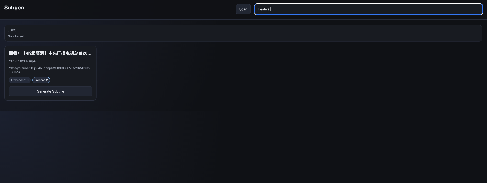

# subgen - Automated subtitle generation via speech-to-text & translation.

Subgen helps you automatically generate subtitle files for any media using OpenAI Whisper STT model, and can also optionally translate into any language using either Google Translate API (good for most use-cases) or Anthropic Claude (enhances semantic understanding for improved translation). This project can be used in conjunction with ex. Jellyfin/Plex to supplement media where subtitle is missing, and allows for seamless translation on the fly.

> Note! I didn't have much time to work on this, so this code is 100% vibe-coded! It works, surprisingly well, but might have some unknown bugs. I tested most flows and it has been working fine for me, but be aware of the risks.

**If subtitle files already exist, subgen can do translation only, making it easy to add additional languages on existing subtitle (both embedded and sidecar supported).

For translation to work you will need to provide a Google Cloud API key or Anthropic API key. See config example.

Note, this project requires running stand alone STT server (micro service) available here: https://github.com/rctl/stt-server
The STT server itself can be used for many differnt use-cases, and allows for more easy sharing of GPU memory between various applications that require STT integration.

## Web UI

Subgen comes with a fully functioning WebUI for easy subtitle generation for new media! 




## Requirements

- Standalone STT server, see: https://github.com/rctl/stt-server

## Usage (Docker)

The main recommended way to run this app is via docker. There's a pre-built image in `rctl/subgen:latest`.

`config.json` is the main way you control the application, please set media directory and mount your media files from your library into the container. Subgen will automatically scan the directory for media. It will also generate an index to make scanning faster (incrementally scanning new media) after future restarts. 

```bash
docker run rctl/subgen:latest -v $(pwd)/config.json:/app/config.json -v /my/media:/media -p 8080:8080
```

Default port is 8080.

Standalone STT server also need to be run (I will not cover how to handle GPU passthrough here, but it is possible):

```
docker run rctl/stt-server -p 8081:8000
```


## Usage (CLI)

Requirements

- Python 3.10+
- `ffmpeg` in PATH

Install Packages

```bash
pip install -r requirements.txt
```

```bash
python -m subgen \
  --input /agent/workspace/jellyfin_sample.mkv \
  --output /agent/workspace/jellyfin_sample.srt \
  --endpoint http://localhost:8000 \
  --lang en \
  --translate-to sv
```

Translation notes:
- Set `GOOGLE_TRANSLATE_API_KEY`, pass `--google-api-key` or provide in `config.json`.
- Translated output is written to `output.{lang}.srt` (e.g., `MovieName.sv.srt`).
- If the original `output.srt` already exists, STT is skipped unless `--force-stt` is used.
- For Jellyfin to detect subtitles, keep the subtitle file next to the video and include the movie filename (e.g., `MovieName.gen_en.srt`).
- Transcription now uses VAD-gated sub-segments (threshold `0.30`) to skip obvious non-speech audio.
- VAD debug logs are printed to stdout per chunk with max score and kept regions.

## Usage (Serve Web UI)
Run the web UI server:
```bash
python -m subgen.web --media-dir /path/to/media --endpoint https://stt.rtek.dev
```
Open `http://localhost:8080` to browse media, inspect subtitles, and generate `gen_[lang].srt` files.

The web UI reads `media_dir` and `stt_endpoint` from `config.json` if CLI flags are not provided.
It also supports optional `index_path` in `config.json` to override where the media index is stored.
Relative `index_path` values are resolved under `media_dir`; absolute paths can place the index outside `media_dir`.
`vad_threshold` is optional in `config.json` and defaults to `0.30`.
Translation provider selection is available in the UI with `Google Translate` and `Anthropic`.
`Google Translate` remains unchanged and uses `google_translate_api_key`.
For Anthropic, set `anthropic_api_key` and `anthropic_model` in `config.json`.
`anthropic_max_parallel` controls concurrent Anthropic batch requests and defaults to `5`.
Anthropic model is passed through directly to the SDK exactly as configured.
